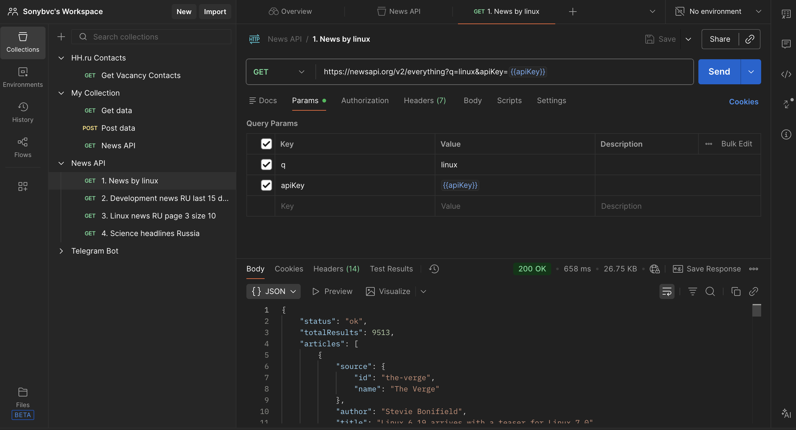
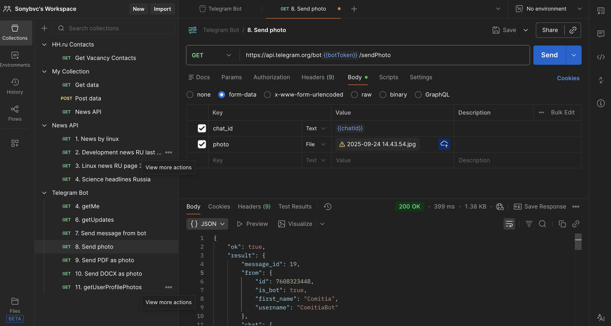

# api-testing-postman

Коллекции запросов в Postman для тестирования разных API. Три отдельные коллекции: News API (публичный с ключом), запросы к hh.ru (без авторизации, но с реальными данными вакансий) и Telegram Bot API (свой бот, отправка сообщений, фото, документов и т.д.).

Делал как практическое задание — потренировался в HTTP-методах, заголовках, авторизации (Bearer), работе с form-data и разборе ответов. Всё работает, запросы сохранены, можно сразу импортировать и запускать.

### Что внутри
- **News API** — запросы к newsapi.org: новости по темам, фильтры по языку, дате, пагинация, категории.
- **hh.ru API** — реальный запрос на контакты вакансии (тот, что браузер делает при клике "Показать контакты").
- **Telegram Bot API** — полный набор: getMe, getUpdates, sendMessage, sendPhoto, sendDocument (pdf/docx), getUserProfilePhotos.

Коллекции экспортированы в JSON, environments тоже (токены и переменные вынесены, чтобы не хардкодить).

### Как использовать
1. Импортируй коллекции в Postman (File → Import → выбери JSON-файлы из репо).
2. Для News API — добавь свой API-ключ в переменную `news_api_key` (в environment).
3. Для Telegram — свой бот-токен в `bot_token` и chat_id в `chat_id`.
4. Для hh.ru — ничего не нужно, запрос работает как есть (но вакансия может устареть, просто замени ID).

### Примеры в работе

Вот как выглядят запросы и ответы (скриншоты из Postman):

#### 1. News API — топ заголовки по науке в России

#### 2. News API — работа с API 

#### 3. Telegram — отправка сообщения от бота

#### 4. Telegram — отправка документа (pdf vs docx — разные ответы)

